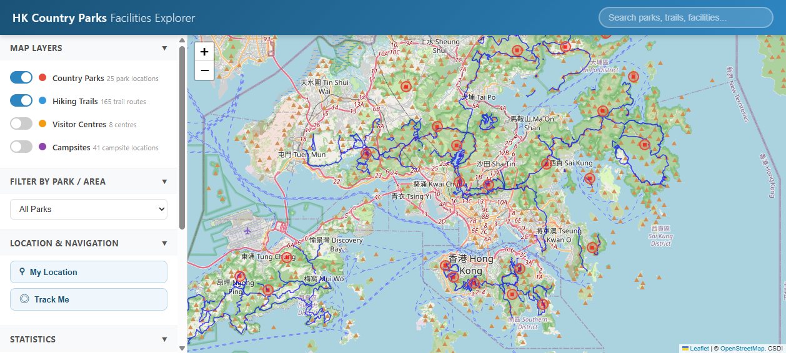
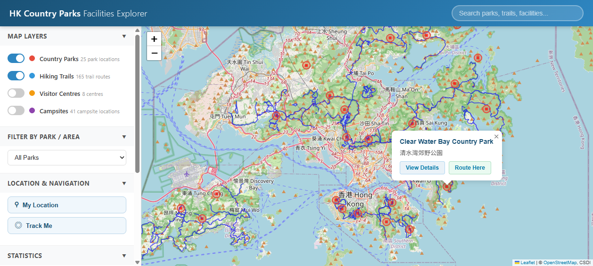
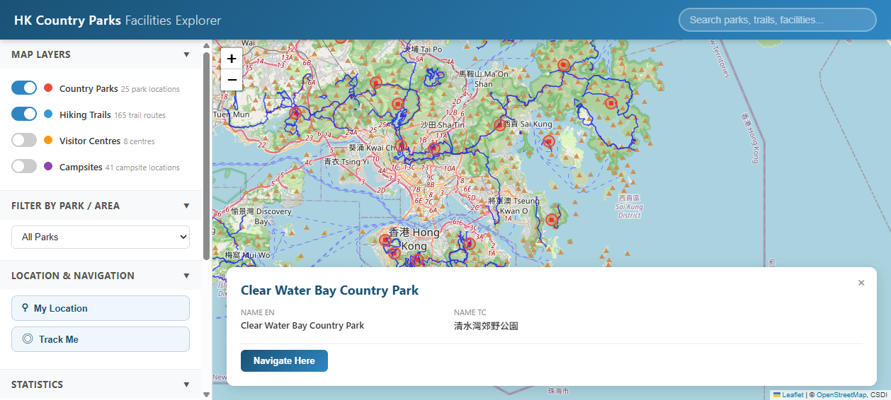
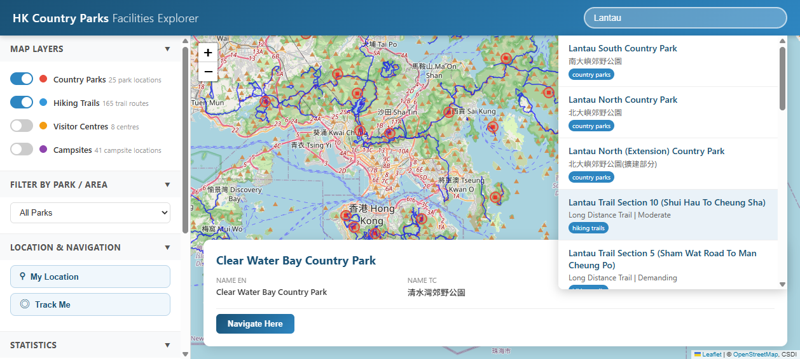
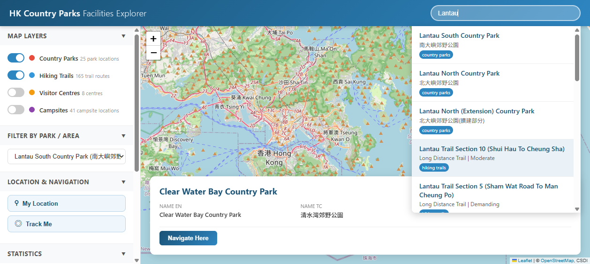
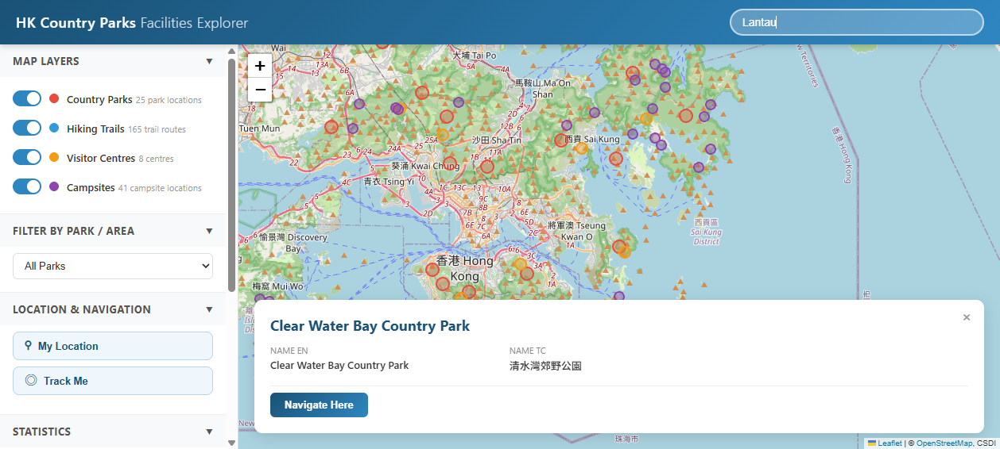

# 🏞️ Hong Kong Country Park Facilities Explorer

> A three-tier Web GIS platform for exploring Hong Kong's country parks, hiking trails, visitor centres, and campsites — built with PostGIS + GeoServer + Leaflet.

[](LICENSE)
[](https://www.php.net/)
[](https://www.postgresql.org/)
[](https://leafletjs.com/)



## ✨ Features

- 🗺️ **Interactive Map** — Leaflet.js with OpenStreetMap base layer + GeoServer WMS overlays
- 🔍 **Cross-Layer Search** — Full-text search across 4 layers with 300ms debounce
- 🏞️ **Park / District Filter** — Filter facilities by 25 country parks or 18 districts
- 📍 **GeoJSON API** — Standard GeoJSON endpoints for all layers
- 📋 **Detail Panel** — Floating panel with feature info (name, type, description, coords)
- 🧭 **Geolocation + Routing** — HTML5 Geolocation + OSRM walking route planning

## 🏗️ Architecture

```
┌─────────────────────────────────────────────────┐
│         Client (Browser SPA)                    │
│  Leaflet.js 1.9.4 · jQuery 3.7.1 · OSRM         │
│  WMS overlays + GeoJSON vectors                 │
└──────────┬─────────────────────┬────────────────┘
           │ AJAX (JSON)         │ WMS / WFS
┌──────────▼──────────┐ ┌───────▼────────────────┐
│  PHP 8.4 REST API   │ │  GeoServer 2.28.2      │
│  (PDO + pgsql)      │ │  WMS / WFS / CQL_FILTER│
└──────────┬──────────┘ └───────┬────────────────┘
           │ PDO_pgsql          │
┌──────────▼────────────────────▼────────────────┐
│  PostgreSQL 18 + PostGIS 3.6 (port 15432)      │
│  4 tables · 239 features · GIST spatial index   │
│  ST_DWithin · ST_AsGeoJSON · ST_Intersects      │
└─────────────────────────────────────────────────┘
```

## 📊 Data

4 datasets from [HK CSDI Portal](https://portal.csdi.gov.hk/) (EPSG:4326):

| Layer | Type | Count | Description |
|-------|------|-------|-------------|
| `country_parks` | Point | 25 | Country park locations |
| `hiking_trails` | LineString / MultiLineString | 165 | Hiking trail routes |
| `visitor_centres` | Point | 8 | Visitor centres |
| `campsites` | Point | 41 | Campsites |

## 🚀 Quick Start

### Prerequisites

- **Apache** 2.4+ (or Nginx)
- **PHP** 8.4+ with `pdo_pgsql` extension
- **PostgreSQL** 14+ with **PostGIS** 3.x
- **GeoServer** 2.20+ (optional, for WMS)

### 1. Database Setup

```bash
# Create database
createdb hk_country_parks
psql -d hk_country_parks -c "CREATE EXTENSION postgis;"

# Import GeoJSON files via ogr2ogr
ogr2ogr -f "PostgreSQL" \
  "PG:host=localhost port=5432 dbname=hk_country_parks user=postgres" \
  country_parks.geojson -nln country_parks -overwrite
ogr2ogr -f "PostgreSQL" \
  "PG:host=localhost port=5432 dbname=hk_country_parks user=postgres" \
  hiking_trails.geojson -nln hiking_trails -overwrite
ogr2ogr -f "PostgreSQL" \
  "PG:host=localhost port=5432 dbname=hk_country_parks user=postgres" \
  visitor_centres.geojson -nln visitor_centres -overwrite
ogr2ogr -f "PostgreSQL" \
  "PG:host=localhost port=5432 dbname=hk_country_parks user=postgres" \
  campsites.geojson -nln campsites -overwrite
```

### 2. Configure API

Edit `api/config.php`:

```php
define('DB_HOST', 'localhost');
define('DB_PORT', 5432);
define('DB_NAME', 'hk_country_parks');
define('DB_USER', 'postgres');
define('DB_PASS', 'your_password');
```

### 3. Deploy

```bash
# Copy to Apache web root
cp -r . /var/www/html/hk_parks/

# Browse to
open http://localhost/hk_parks/
```

### 4. GeoServer (Optional, for WMS)

1. Create workspace `hk_data`
2. Create datastore pointing to PostgreSQL DB
3. Publish 4 layers with native SRS = EPSG:4326
4. Update `GEOSERVER_URL` in `js/app.js` if needed

## 📁 Project Structure

```
hk-country-parks-webgis/
├── index.html                # Main SPA entry
├── api/
│   ├── config.php            # PDO singleton + jsonResponse()
│   ├── get_features.php      # GeoJSON retrieval with filters
│   ├── get_detail.php        # Single feature detail
│   ├── get_filter_data.php   # Park-district mapping (ST_DWithin)
│   ├── get_parks.php         # Park list for dropdown
│   └── search.php            # Cross-layer ILIKE search
├── js/
│   └── app.js                # 773-line Leaflet SPA
├── css/
│   └── style.css             # Styles
├── screenshots/              # 6 demo screenshots
└── README.md
```

## 🔑 Key PostGIS Functions

| Function | Usage |
|----------|-------|
| `ST_DWithin` | Find facilities within X km of a park |
| `ST_AsGeoJSON` | Convert geometry to GeoJSON |
| `ST_Intersects` | bbox spatial filter |
| `ST_MakeEnvelope` | Build bbox polygon |

## 🎨 Screenshots

| Overview | Popup | Detail Panel |
|----------|-------|--------------|
|  |  |  |

| Search | Filter | All Layers |
|--------|--------|------------|
|  |  |  |

## 📜 License

MIT License — see [LICENSE](LICENSE).

## 🙏 Acknowledgements

- Data: [Hong Kong CSDI Portal](https://portal.csdi.gov.hk/) (AFCD datasets)
- Base map: [OpenStreetMap](https://www.openstreetmap.org/) contributors
- Routing: [OSRM](https://project-osrm.org/) public API
- Built for **GEOD7311 Web GIS** course, HKU
